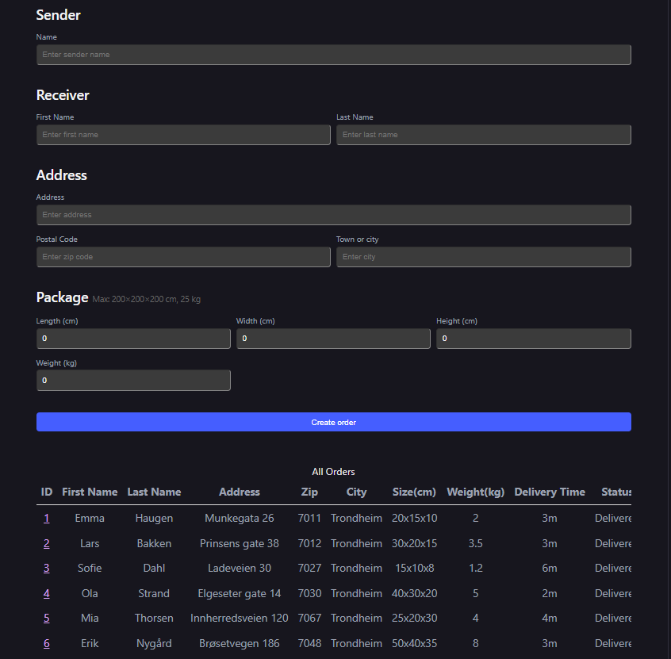
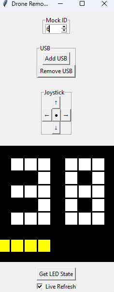
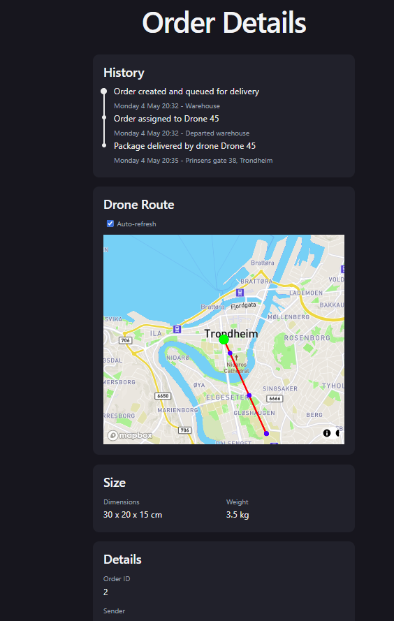
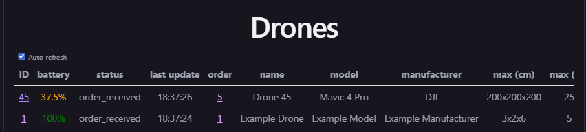
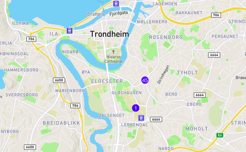
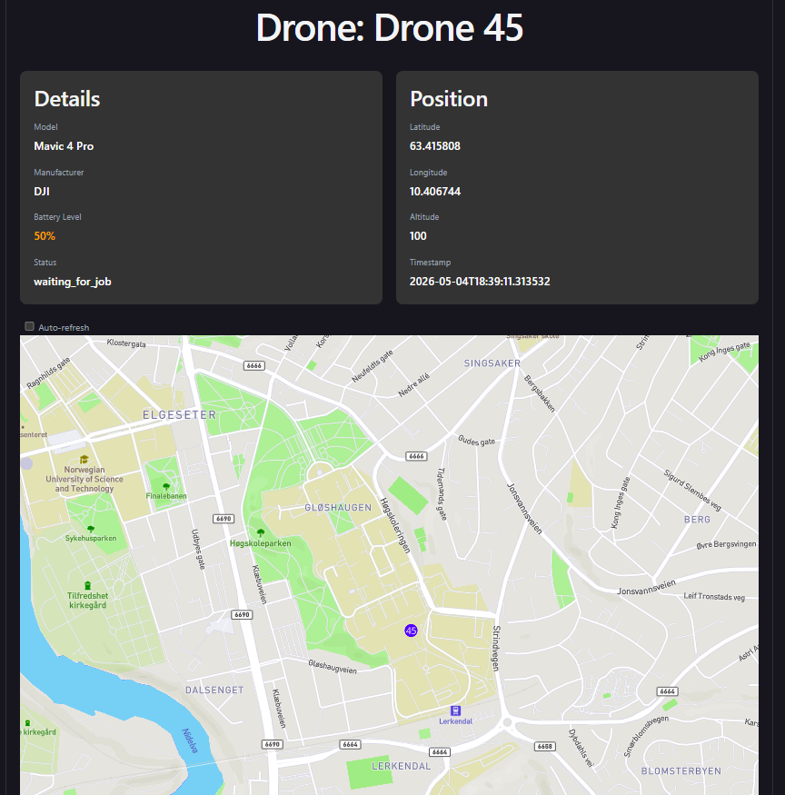

# ttm4115

This application is a system for drone delivery. It is supposed to be a supplement to other deliveries like car, so that the drones handles the small items, while the cars is used as fallback.

The express API receives orders either from the integrated systems package handling, or in this example from the /orders page, where you can manually add packages.



After receiving orders, the backend assigns orders to available drones, that are capable of delivering the package: That means, enough battery, the package is within the dimensions, and it does not weight too much.

The drone application is supposed to be attached to a drone, and control it based on communication with the backend. The controller checks battery-status on the drone, and sends heartbeat to the backend containing deliver status, battery and position. 



The end user can check delivery-status in the /orders/{orderId} page. Here you can see the current drone position, history of where the package has been, and more details like dimensions and weight. 



in the page /operator, the drone operators can see where all of the drones are, and their statuses. By checking last update time they can see if drones are dead, and needs recovery, or when and where their last position were. They can also see what drones have which package, and if they need charging.





## DEV

### run frontend in dev

```bash
cd frontend
npm i
npm run dev
```

### run backend in dev

```bash
cd backend
npm i
npm run dev
```


## GET STARTED

### env files

in the folders 
> /frontend

> /backend

> /drone

there are .env.example files. To be able to run the system you have to create a .env file in the same location and fill in the env-variables listed. You can use the .env.example files for this, (by just renaming to .env), but for the frontend one, you have to create an api key in mapbox https://console.mapbox.com/ to make the maps and orders to work


### run production

from root
> docker compose build --no-cache 

> docker compose up -d

this will create 5 mock drones, that can be controlled by the remote_controller.py. This is only used in the mock drones so it will not auto launch from docker.
