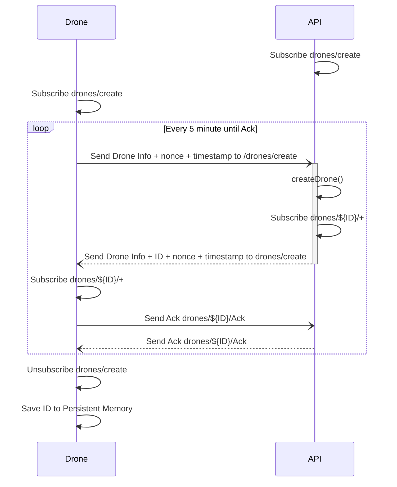

# Drone Create

```mermaid
sequenceDiagram
    participant Drone
    participant API

    API->>API: Subscribe drones/create
    Drone->>Drone: Subscribe drones/create

    loop Every 5 minute until Ack
        Drone-)+API: Send Drone Info + nonce + timestamp to /drones/create

        API->>API: createDrone()

        API->>API: Subscribe drones/${ID}/+

        API--)-Drone: Send Drone Info + ID + nonce + timestamp to drones/create

        Drone->>Drone: Subscribe drones/${ID}/+

        Drone-)API: Send Ack drones/${ID}/Ack

        API--)Drone: Send Ack drones/${ID}/Ack
    end

    Drone->>Drone: Unsubscribe drones/create

    Drone->>Drone: Save ID to Persistent Memory
```
