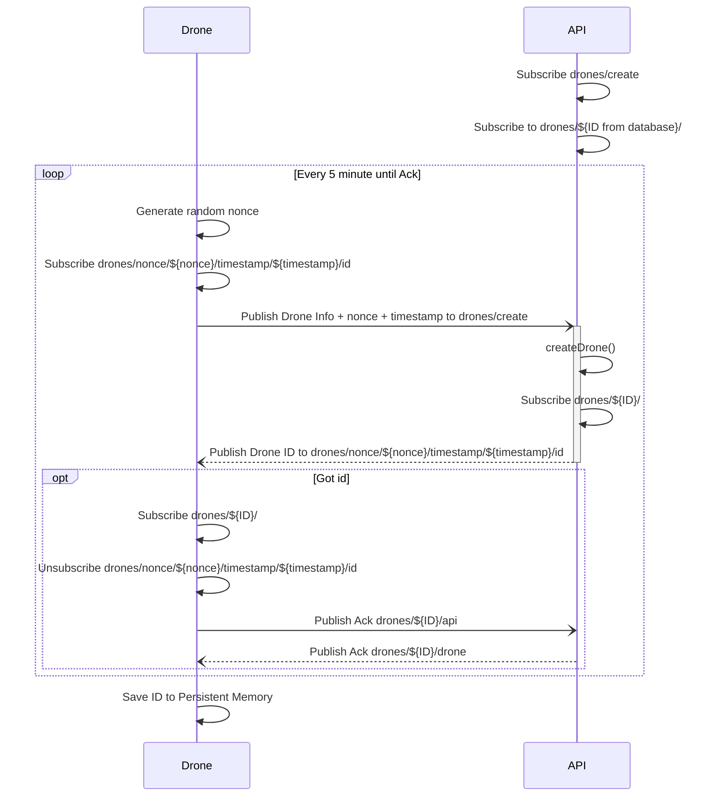

# Drone Create

```mermaid
sequenceDiagram
    participant Drone
    participant API

    API->>API: Subscribe drones/create

    API->>API: Subscribe to drones/${ID from database}/#

    loop Every 5 minute until Ack
        Drone->>Drone: Generate random nonce

        Drone->>Drone: Subscribe drones/nonce/${nonce}/timestamp/${timestamp}/id

        Drone-)+API: Publish Drone Info + nonce + timestamp to drones/create

        API->>API: createDrone()

        API->>API: Subscribe drones/${ID}/#

        API--)-Drone: Publish Drone ID to drones/nonce/${nonce}/timestamp/${timestamp}/id

        opt Got id
            Drone->>Drone: Subscribe drones/${ID}/#

            Drone->>Drone: Unsubscribe drones/nonce/${nonce}/timestamp/${timestamp}/id

            Drone-)API: Publish Ack drones/${ID}/api

            API--)Drone: Publish Ack drones/${ID}/drone
        end
    end

    Drone->>Drone: Save ID to Persistent Memory
```
